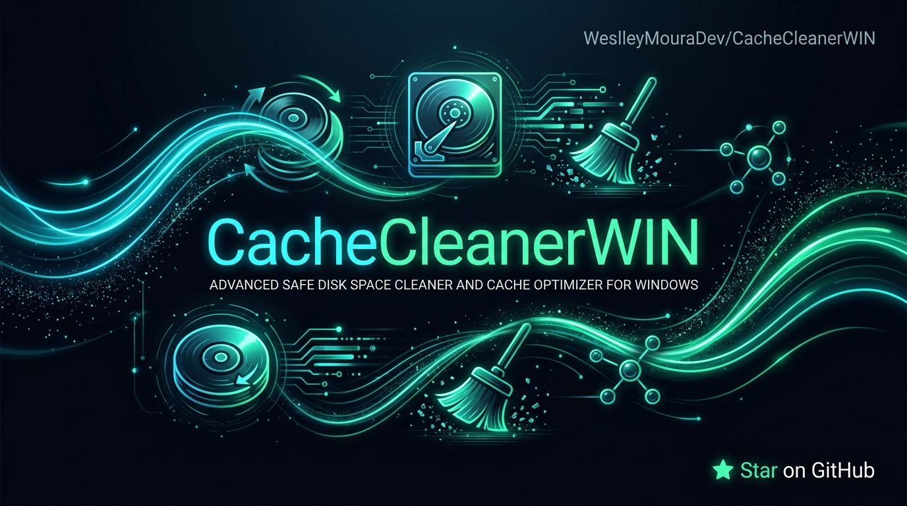

<div align="center">

# 🧹 CacheCleanerWIN
### Limpeza Segura de Disco, Caches do Sistema e Otimização para Windows

[](https://github.com/WeslleyMouraDev/CacheCleanerWIN)

<p align="center">
  <!-- Python -->
  
  <!-- Plataforma -->
  
  <!-- UI Framework -->
  
  <!-- Testes -->
  
  <!-- Licença -->
  
</p>

<p align="center">
  <strong>Libere gigabytes de espaço em disco de forma 100% segura, rápida e com design de terminal de última geração.</strong><br>
  Sem configurações complexas. Zero risco para arquivos vitais do Windows.
</p>

[Visão Geral](#-visão-geral) •
[Funcionalidades](#-principais-funcionalidades) •
[Demonstração](#-demonstração-da-interface) •
[Como Executar](#-como-executar) •
[Arquitetura](#-arquitetura-e-estrutura) •
[Garantia de Qualidade](#-garantia-de-qualidade-e-testes) •
[Licença](#-licença)

---

</div>

## 📌 Visão Geral

Com o uso diário, o Windows e os navegadores web acumulam dezenas de gigabytes em caches obsoletos, arquivos temporários de atualização e downloads órfãos. Muitas ferramentas de limpeza do mercado são invasivas, instalam malwares ou correm o risco de corromper o sistema operacional.

O **CacheCleanerWIN** foi construído para resolver este problema oferecendo uma experiência premium no terminal:
1. **Limpeza Segura (Safe-by-Default):** Apenas áreas de cache comprovadamente descartáveis são limpas. Arquivos em uso são detectados e ignorados sem erros.
2. **Scanner Inteligente de Pastas Grandes:** Identifica diretórios com mais de 500 MB nas pastas do usuário (`Downloads`, `Documentos`, `Desktop`).
3. **Mecanismo de Dupla Confirmação:** Nenhuma pasta importante é apagada sem que o usuário confirme explicitamente duas vezes.
4. **Métricas Claras:** Apresenta o espaço livre antes, depois e o total liberado.

---

## ⚡ Principais Funcionalidades

| Recurso | Descrição |
| :--- | :--- |
| **Limpeza de Caches de Sistema** | Remove com segurança `%TEMP%`, `C:\Windows\Temp`, `Prefetch` e resíduos de instaladores. |
| **Caches de Atualização** | Limpa arquivos baixados obsoletos em `C:\Windows\SoftwareDistribution\Download`. |
| **Caches de Navegadores** | Esvazia caches redundantes do **Google Chrome**, **Microsoft Edge** e **Mozilla Firefox**. |
| **Detector de Pastas Grandes** | Localiza diretórios que estão consumindo mais de 500 MB na área pessoal do usuário. |
| **Proteção com Confirmação Dupla** | Protege contra exclusões acidentais exigindo confirmação dupla com alertas coloridos. |
| **Launcher Windows (.bat)** | Inicializador com auto-criação de ambiente virtual (`.venv`), instalação de dependências e suporte total a UTF-8. |
| **UI de Terminal Premium** | Desenvolvido com `Rich`, com spinners animados, tabelas coloridas e painéis visuais. |

---

## 🖥️ Demonstração da Interface

```text
 ╭──────────────────────────────────────────────╮
 │ CacheCleanerWIN                              │
 │ Limpeza segura de disco.                     │
 ╰──────────────────────────────────────────────╯

Iniciando limpeza de caches segura...
[OK] Limpeza de caches finalizada!

Verificando pastas grandes de usuário...
             Pastas Grandes Encontradas (>500MB)             
┏━━━━━━━━━━━━━━━━━━━━━━━━━━━━━━━━━━━━━━━━┳━━━━━━━━━━━━━━━━━━┓
┃ Caminho                                ┃     Tamanho (MB) ┃
┡━━━━━━━━━━━━━━━━━━━━━━━━━━━━━━━━━━━━━━━━╇━━━━━━━━━━━━━━━━━━┩
│ C:\Users\Dev\Downloads\Old_Projects     │          1420.50 │
│ C:\Users\Dev\Downloads\ISO_Images       │          3840.10 │
└────────────────────────────────────────┴──────────────────┘

 ╭────────────── Resumo de Espaço ──────────────╮
 │ Antes: 42100.50 MB                           │
 │ Depois: 45890.20 MB                          │
 │ Liberado: 3789.70 MB                         │
 ╰──────────────────────────────────────────────╯
Processo finalizado!
```

---

## 🚀 Como Executar

### 💻 No Windows (Recomendado com 1 Clique)

1. Clone o repositório:
   ```cmd
   git clone https://github.com/WeslleyMouraDev/CacheCleanerWIN.git
   cd CacheCleanerWIN
   ```

2. Dê um duplo-clique no arquivo `iniciar.bat` ou execute via terminal:
   ```cmd
   iniciar.bat
   ```

> [!NOTE]
> O arquivo `iniciar.bat` gerencia tudo automaticamente: verifica a presença do Python, cria um ambiente virtual isolado (`.venv`), instala o pacote `rich` e executa a aplicação.

---

### 🐍 Execução Manual via Python

Caso prefira gerenciar o ambiente você mesmo:

```cmd
python -m venv .venv
.venv\Scripts\activate
pip install -r requirements.txt
python src/main.py
```

---

## 🏗️ Arquitetura e Estrutura

```text
CacheCleanerWIN/
├── iniciar.bat               # Launcher Windows resiliente (CRLF, UTF-8, venv automático)
├── requirements.txt          # Dependências do projeto (rich, pytest)
├── pytest.ini                # Configurações do ambiente de testes
├── src/
│   ├── __init__.py           # Identificador de módulo
│   ├── main.py               # Orquestrador principal do fluxo de limpeza
│   ├── cleaner.py            # Lógica de remoção de caches e métricas de disco
│   ├── scanner.py            # Varredura inteligente de pastas grandes (>500MB)
│   └── ui.py                 # Componentes visuais Rich (painéis, prompts, tabelas)
├── tests/
│   ├── test_cleaner.py       # Testes unitários do módulo de limpeza
│   ├── test_scanner.py       # Testes unitários do scanner de diretórios
│   └── test_ui.py            # Testes unitários dos helpers de interface
└── docs/
    ├── assets/
    │   └── banner.png        # Hero banner do projeto em 16:9
    └── superpowers/
        ├── specs/            # Especificações de design
        └── plans/            # Planos de implementação e relatórios de revisão
```

---

## 🧪 Garantia de Qualidade e Testes

O projeto segue padrões de **Test-Driven Development (TDD)** e conta com 100% de aprovação na suíte de testes automatizados:

```cmd
pytest
```

```text
============================= test session starts =============================
platform win32 -- Python 3.12.8, pytest-8.3.4
collected 14 items

tests\test_cleaner.py .....                                              [ 35%]
tests\test_scanner.py .....                                              [ 71%]
tests\test_ui.py ....                                                    [100%]

============================== 14 passed in 0.32s =============================
```

---

## 🤝 Contribuição

Contribuições são muito bem-vindas! Siga os passos:

1. Faça um Fork do projeto
2. Crie uma branch para a sua feature (`git checkout -b feature/MinhaFeature`)
3. Faça commit das alterações (`git commit -m 'feat: minha nova feature'`)
4. Envie para o branch remoto (`git push origin feature/MinhaFeature`)
5. Abra um Pull Request

---

## 📄 Licença

Este projeto está sob a licença **MIT**. Veja o arquivo [LICENSE](LICENSE) para mais detalhes.

<div align="center">
  <sub>Desenvolvido com excelência técnica por <a href="https://github.com/WeslleyMouraDev">Weslley Moura</a>.</sub>
</div>
